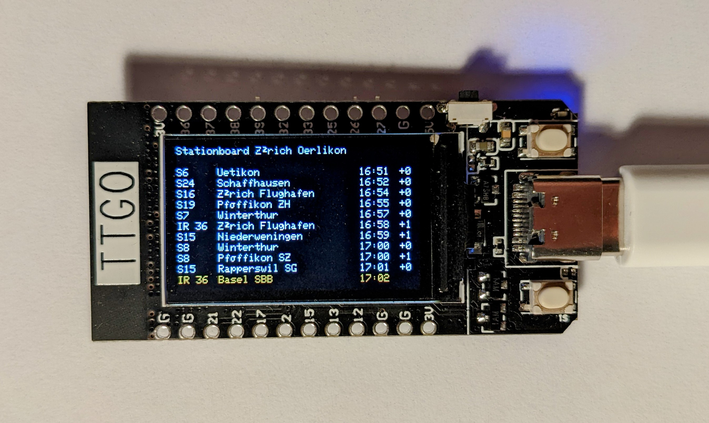

# swiss-stationboard-arduino

Display the stationboard of any swiss public transport station on your TTGO Display ESP32 board.



## Hardware
Intended to use with TTGO Display boards. (Order here: https://de.aliexpress.com/item/33048962331.html)

## Usage
Adjust the user_define.h file:
```c++
// ------------USER DEFINED PARAMETERS HERE-------------
const char* ssid = "PUT_YOUR_SSID_HERE";           
const char* password = "PUT_YOUR_PWD_HERE";

const char* station_id = "8503006"; //Zürich Oerlikon

// Highlight Yellow
const char* highlight1_line = "S7";
const char* highlight1_destination = "Rapperswil SG";

// Highlight Orange
const char* highlight2_line = "IR 36";
const char* highlight2_destination = "Basel SBB";

// Highlight Skyblue
const char* highlight3_line = "S6";
const char* highlight3_destination = "Baden";

// ----------END USER DEFINE--------------
```
- Modify ssid and password to your wlan credentials
- Change station_id to your desired station. Call https://timetable.search.ch/api/completion.en.json?show_ids=1&term=zurich to get your station ID.
- Adjust highlighted connections to your preference. 
